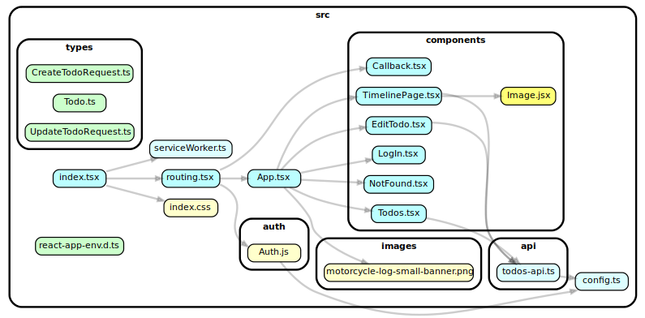
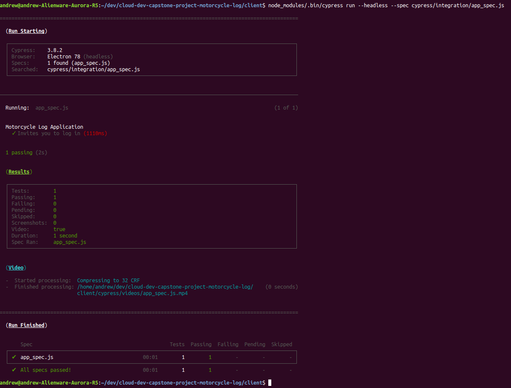
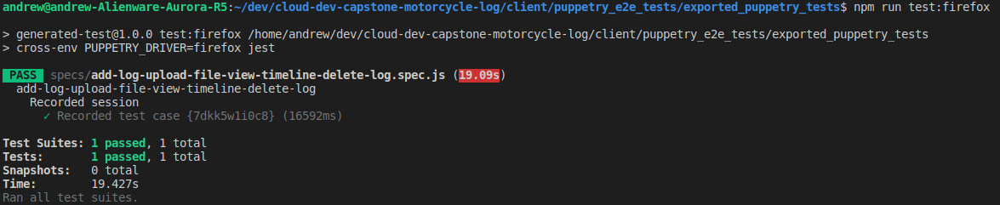
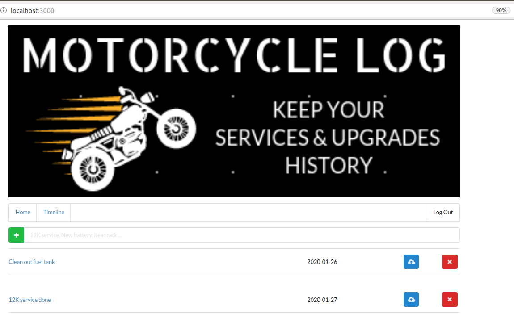
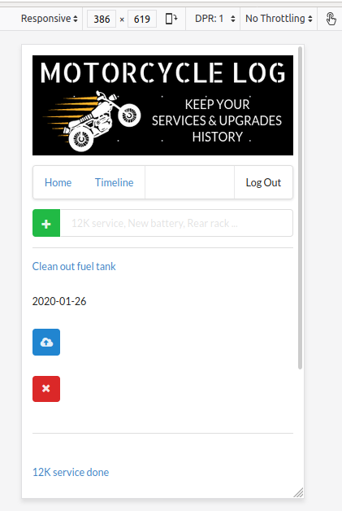
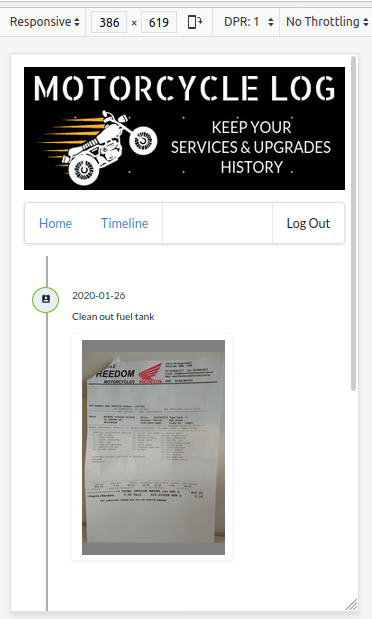

# Cloud Developer Nanodegree Capstone Project

## Project Scope, Serverless Design, Build and Test

1. Create Serverless Motorcycle Log - simple list of all your motorcycle events - based on Project Serverless Todos.
2. Refactor
   1. Create new Github repository, clone to local repository, download Project Serverless Todos and copy into cloned repo.
   2. Refactor existing /client into Motorcycle Log creating and inserting customised small banner.
   
3. Explore end-to-end (e2e) functional test tools and implement.
    1. Assessed Cypress however eventually ran into this [blocking issue](https://github.com/cypress-io/cypress/issues/944) so removed it and continued search.
    
    2. Found Pupperty which enables you to record a scenario quickly. You can then extract out the common sub-scenarios (like Log In) and import these into future tests. Also enables you to export to CI friendly format. This is how I run tests from the terminal.
    
4. Adjust design to be responsive, with preference for mobile viewing.
    
    
5. Add Timeline page to enable vertical view of Motorcycle Log entries showing small image of uploaded documents e.g. itemised receipts, etc.

